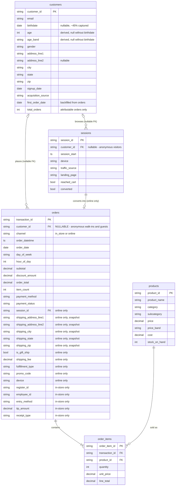

# CapFinch Data Dictionary

## Introduction

CapFinch is a boutique retail store with a physical location. Today it runs on a Square POS
system and Mailchimp email marketing, and it is launching its **first** e-commerce website with
**no** historical online data. To build and test the analytics/KPI pipeline before launch, we
generate a **synthetic dataset** that imitates what real online-platform data (Shopify / Square
Online / GA4 style) would look like once the site is live, alongside the in-store history the
POS already produces.

Sales therefore arrive from **two channels**. Both land in a single `orders` table tagged with a
`channel` flag, with channel-specific columns left null on the other side — the same way Square's
Orders API mixes in-store and Square Online sales. Keeping one fact table means revenue, AOV,
category mix, and top-seller queries never need a UNION, and "did the website add revenue or just
move it online?" is a single `GROUP BY channel`.

The dataset is organized around two anchor keys:

- **`transaction_id`** — primary key of `orders`; one row per completed sale (revenue, AOV).
- **`customer_id`** — primary key of `customers`; one row per person (repeat rate, demographics).
  **Nullable on `orders`**: most walk-ins are anonymous and some online buyers check out as guests.

These join together via `customer_id`, which is a foreign key inside `orders`. This lets us
analyze the data both per-sale and per-customer.

## Entity relationship diagram

Also available as images for slides and docs: [erd.svg](erd.svg) (vector) and [erd.png](erd.png)
(raster). Regenerate both after a schema change with:

```bash
python render_erd.py
python -m cairosvg erd.svg -o erd.png -f png
```



**Reading the cardinality**

- `customers |o--o{ orders` — a customer has any number of orders, but an order has **zero or one**
  customer. That optionality is the single most important thing in this model: ~68% of in-store
  orders and ~12% of online orders have no `customer_id` at all. Any inner join from `orders` to
  `customers` silently drops the majority of in-store revenue.
- `sessions ||--o| orders` — every online order comes from exactly one session, and a session
  converts into at most one order. In-store orders have no session, which is why the funnel KPIs
  are online-only.
- `orders ||--|{ order_items` — every order has at least one line item.
- `products ||--o{ order_items` — every line item references one SKU, while a SKU can appear in
  many line items or none in a small sample.

**Simplified chain**

```
customers ─┬─ sessions          (online only)
           └─ orders ── order_items ── products
```

**Realism rules the generator enforces**

| Rule | Detail |
|---|---|
| Store hours | Open every day 10:00–18:00; no in-store order falls outside that window |
| In-store time-of-day | Slow morning, lunch bump, late-afternoon peak |
| In-store day-of-week | Saturday busiest, Mon/Tue slowest |
| Online time-of-day | 24/7 with a 19:00–22:00 peak and a 02:00–06:00 trough |
| Timeline | In-store history predates launch; online orders start on `LAUNCH_DATE` |
| Identity capture | ~68% of in-store orders anonymous; ~12% of online orders are guests |
| Payment mix | Cash / gift card only in store; PayPal only online |
| Basket size | Larger in store, mostly single-item online |

---

## Table 1: `customers`

**Purpose:** The people dimension. One row per unique customer (the "who"). Square Customer
Directory equivalent. Anchor for per-person KPIs like repeat purchase rate, age band, and
location. Only people CapFinch can actually identify appear here — anonymous walk-ins never do,
so not every order links back to a row in this table.

**`birthdate` is optional and is the source of truth for age.** Handing over a birthday is opt-in
at signup, so only ~45% of customers have one on file; `age` and `age_band` are derived from it
and are **null for everyone else**. Age-based analysis has to handle that gap rather than assume
full coverage.

**The address here is the customer's default / billing address.** It is stored as separate
components rather than one blob so location analysis can group by state or zip without parsing.
Customers cluster near the store (Richmond, VA) rather than spreading evenly over all 50 states,
and the zip prefix is derived from the state so the two always agree.

| Field | Type | Key | Description | Example |
|---|---|---|---|---|
| `customer_id` | string | PK | Unique, stable ID for one person; reused across all their orders and sessions | `CUST0042` |
| `email` | string | | Contact address; join key to Mailchimp audience data | `a***@gmail.com` |
| `birthdate` | date | | Date of birth; **nullable** — only captured when the customer opts in | `1991-05-10` |
| `age` | int | | Years old, derived from `birthdate`; **null when no birthday on file** | `35` |
| `age_band` | string | | Pre-bucketed age group (18-24 / 25-34 / 35-44 / 45+); **null when no birthday** | `35-44` |
| `gender` | string | | Self-reported gender (`female` / `male`) | `female` |
| `address_line1` | string | | Street number and name | `835 Jeremy Bypass` |
| `address_line2` | string | | Apartment / suite; **nullable**, ~25% of addresses | `Apt. 106` |
| `city` | string | | City name | `Richardland` |
| `state` | string | | Two-letter US state; used for Sales by Location | `VA` |
| `zip` | string | | Postal code; prefix always matches `state` | `23219` |
| `signup_date` | date | | When the account/email was first created; cohort anchor | `2026-01-15` |
| `acquisition_source` | string | | How the customer first arrived (organic / mailchimp / social / referral) | `mailchimp` |
| `first_order_date` | date | | Date of first *attributable* purchase, either channel; null if never bought | `2026-01-20` |
| `total_orders` | int | | Lifetime count of orders attributed to this customer; ≥2 flags a repeat buyer | `3` |

---

## Table 2: `orders`

**Purpose:** The transaction fact table (the "what was bought, when, for how much"). One row per
completed purchase from **either** channel. Square Payments/Orders equivalent. Source for revenue,
AOV, daily sales, and channel comparison. Header-level only; itemized detail lives in `order_items`.

### Shared fields (always populated)

| Field | Type | Key | Description | Example |
|---|---|---|---|---|
| `transaction_id` | string | PK | Unique ID for one completed order | `TXN00578` |
| `customer_id` | string | FK → customers (nullable) | Who placed the order; **null** for an anonymous walk-in or guest checkout | `CUST0042` |
| `channel` | string | | `in_store` or `online`; the flag every channel cut keys off | `in_store` |
| `order_datetime` | timestamp | | Date/time the order was placed | `2026-03-04 14:22:11` |
| `order_date` | date | | Date only; grain for daily KPIs | `2026-03-04` |
| `day_of_week` | string | | Derived from `order_datetime`; weekday/weekend cuts | `Saturday` |
| `hour_of_day` | int | | Derived; 10–17 in store, 0–23 online | `14` |
| `subtotal` | decimal | | Sum of the order's `order_items.line_total`, before discount | `84.50` |
| `discount_amount` | decimal | | Total promo/discount applied; 0 if none | `5.00` |
| `order_total` | decimal | | `subtotal − discount_amount + shipping_fee` | `79.50` |
| `item_count` | int | | Number of units in the order | `2` |
| `payment_method` | string | | Tender type; vocabulary differs by channel | `card_present` |
| `payment_status` | string | | Processor result (authorized / declined); feeds Payment Success Rate | `authorized` |

### Online-only fields (null when `channel = 'in_store'`)

The shipping address is a **snapshot taken at order time**, deliberately duplicated from
`customers` rather than joined. Addresses change; an order has to record where the parcel
actually went. Recomputing it from the customer's current address would silently rewrite history.

| Field | Type | Key | Description | Example |
|---|---|---|---|---|
| `session_id` | string | FK → sessions | Which website visit produced this order; the join that powers conversion rate | `SESS009912` |
| `shipping_address_line1` | string | | Ship-to street number and name | `835 Jeremy Bypass` |
| `shipping_address_line2` | string | | Ship-to apartment / suite; nullable | `Apt. 106` |
| `shipping_city` | string | | Ship-to city | `Richardland` |
| `shipping_state` | string | | Ship-to state; may differ from the buyer's home state | `VA` |
| `shipping_zip` | string | | Ship-to postal code; prefix always matches `shipping_state` | `23219` |
| `is_gift_ship` | bool | | True when the parcel went somewhere other than the buyer's address on file — the gift-order signal | `false` |
| `shipping_fee` | decimal | | 0 for pickup or orders over the free-shipping threshold | `6.95` |
| `fulfillment_type` | string | | `ship` or `pickup_in_store` | `ship` |
| `promo_code` | string | | Code entered at checkout; ties discounts to campaigns. Null when no discount | `MAILCHIMP15` |
| `device` | string | | Device used (mobile / desktop / tablet); copied from the session | `mobile` |

### In-store-only fields (null when `channel = 'online'`)

| Field | Type | Key | Description | Example |
|---|---|---|---|---|
| `register_id` | string | | Which POS terminal rang the sale | `REG01` |
| `employee_id` | string | | Cashier; enables sales-per-associate | `EMP03` |
| `entry_method` | string | | `chip` / `tap` / `swipe`; null for cash | `chip` |
| `tip_amount` | decimal | | Square tip prompt; usually 0 for retail | `0.00` |
| `receipt_type` | string | | `email` / `sms` / `printed` / `none`. A digital receipt is what links a walk-in to a customer record | `email` |

> **No `is_first_order` flag.** It is derivable from `customers.first_order_date`, and would be
> misleading anyway: with most in-store sales anonymous, a customer's true first purchase may never
> have been attributed.

---

## Table 3: `order_items`

**Purpose:** The line-item detail (the "what products, at what price"). One row per product per
order (Square line_items). Source for top sellers, category mix, price bands, and 80/20 Pareto
analysis.

| Field | Type | Key | Description | Example |
|---|---|---|---|---|
| `order_item_id` | string | PK | Unique ID for one line within one order | `OI_0001923` |
| `transaction_id` | string | FK → orders | Which order this line belongs to | `TXN_000578` |
| `product_id` | string | FK → products | Which product/SKU was purchased | `PROD_0087` |
| `quantity` | int | | Units of this product on the line | `1` |
| `unit_price` | decimal | | Price of one unit at time of sale | `42.25` |
| `line_total` | decimal | | `quantity × unit_price`; summed to `order_total` | `42.25` |

---

## Table 4: `products`

**Purpose:** The product catalog dimension (the "what CapFinch sells"). One row per SKU (Square
Catalog equivalent). Attaches category, price, and margin to each line item; supports Inventory
Sync Accuracy.

CapFinch is a boutique carrying 38 SKUs across 5 main categories and 19 subcategories.

| Category | Subcategory | Price Range |
|---|---|---|
| **Apparel** | Tops | $35–$85 |
| | Dresses | $65–$185 |
| | Outerwear | $95–$250 |
| | Bottoms | $55–$120 |
| | Denim | $80–$160 |
| **Accessories** | Jewelry (everyday) | $20–$65 |
| | Jewelry (statement/special occasion) | $65–$150 |
| | Handbags | $75–$220 |
| | Scarves & wraps | $30–$70 |
| | Belts | $25–$55 |
| | Sunglasses | $30–$90 |
| **Footwear** | Sandals/flats | $50–$95 |
| | Boots | $110–$220 |
| | Heels | $70–$140 |
| **Home & Gift** | Candles | $18–$38 |
| | Small home decor | $25–$60 |
| | Gift sets | $35–$75 |
| **Beauty/Wellness** | Skincare | $20–$55 |
| | Fragrance | $45–$95 |

Prices and costs end in `.99` or round numbers (`.00`). Stock is kept at **small-boutique depth** — roughly 6–35 units.

**Sell-through is deliberately Pareto.** Every SKU gets a popularity weight built from price
elasticity (cheap impulse items outsell anchors), a hero boost for a handful of designated best
sellers, and a lognormal taste jitter. That weight drives what gets bought (`order_items`), so
top-seller and 80/20 analysis is meaningful and a few SKUs land with zero sales — as they would in
a real catalog. The weight is a **generator input, not a column** on this table; Square's catalog
export wouldn't contain it.

| Field | Type | Key | Description | Example |
|---|---|---|---|---|
| `product_id` | string | PK | Unique SKU identifier | `PROD0001` |
| `product_name` | string | | Human-readable product name | `Ribbed Cotton Knit Tee` |
| `category` | string | | Main merchandise category | `Apparel` |
| `subcategory` | string | | Specific product subcategory | `Tops` |
| `price` | decimal | | Current list/selling price | `38.00` |
| `price_band` | string | | Pre-bucketed price tier (<$50 / $50-100 / $100-200 / $200+) | `$50-100` |
| `cost` | decimal | | Unit cost | `15.00` |
| `stock_on_hand` | int | | Current inventory units | `24` |

---

## Table 5: `sessions`

**Purpose:** The web-traffic layer (the "visits," including browsers who never bought). One row
per site visit. The piece a physical POS lacks; without it Conversion Rate and Cart Abandonment
cannot be computed. Denominator for the funnel — and **online only**: in-store orders appear on
neither side of the conversion ratio. All sessions fall on or after the site launch date.

| Field | Type | Key | Description | Example |
|---|---|---|---|---|
| `session_id` | string | PK | Unique ID for one website visit | `SESS_09912` |
| `customer_id` | string | FK → customers (nullable) | The visitor if known; null = anonymous browser | `CUST_00042` |
| `session_start` | timestamp | | When the visit began; daily grain for traffic KPIs | `2026-03-04 14:05` |
| `device` | string | | Device category (mobile / desktop / tablet) | `mobile` |
| `traffic_source` | string | | What drove the visit (organic / mailchimp / social / referral) | `mailchimp` |
| `landing_page` | string | | First page the visitor hit | `/home` |
| `reached_cart` | bool | | True if visitor added to cart; denominator for abandonment | `true` |
| `converted` | bool | | True if the visit ended in a completed order; numerator for conversion | `true` |

---

## Data Integrity Rules

**Money**
- `order_items.line_total` = `quantity × unit_price`
- `orders.subtotal` = sum(`order_items.line_total`) for that `transaction_id`
- `orders.order_total` = `subtotal − discount_amount + shipping_fee` (shipping treated as 0 in store)

**Keys**
- Every non-null `orders.customer_id` must exist in `customers`
- Every `orders.session_id` must exist in `sessions`
- `customers.total_orders` = count of that customer's rows in `orders`, across both channels
- `customers.first_order_date` = earliest `order_datetime` attributed to that customer
- `customers.age` / `age_band` are non-null **only** when `customers.birthdate` is non-null

**Addresses**
- A zip always begins with the prefix registered for its state, on both `customers` and `orders`
- When `is_gift_ship = false` and `customer_id` is set, the order's shipping address equals that
  customer's address on file
- `is_gift_ship = true` for every guest checkout, since there is no address on file to compare against

**Channel**
- `channel = 'in_store'` → all online-only fields are null and no session exists
- `channel = 'online'` → `session_id` is non-null and that session has `converted = true`
- A session with `converted = true` has exactly one matching online row in `orders`
- Count of converted sessions = count of online orders

**Timing**
- In-store `hour_of_day` is between 10 and 17 inclusive (store open 10:00–18:00)
- No online order predates the site launch date

**Funnel (online only)**
- Conversion rate = online orders / total sessions; in-store orders are excluded
- Only sessions with `reached_cart = true` count in the abandonment denominator